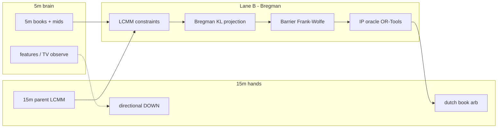

# Roan / Bregman architecture — BTC Pulse (Phase 0)

**Status:** Phases 0–6 implemented (2026-06-27). Paper-only; 5m brain / 15m hands live.  
**References:** `references/(4) Roan…Polymarket Roadmap.pdf`, `references/(5) Roan…Loop Engineering.pdf`, [arXiv:2508.03474](https://arxiv.org/abs/2508.03474), [arXiv:1606.02825](https://arxiv.org/abs/1606.02825)  
**Companion:** `scripts/pulse-babysit/roan-bregman-promotion-scorecard.json`, `scripts/pulse-babysit/frozen-env-keys.json`

---

## Core quant design: 5m brain, 15m hands

The bot is **engineered on the 5-minute BTC up/down microstructure** but **executes on 15-minute windows**. This is deliberate institutional practice: faster series for information and constraint discovery; slower series for fills, settlement, and capital efficiency.

| Role | Series | What runs here |
|------|--------|----------------|
| **Brain (5m)** | `btc-up-or-down-5m` | Regime features, CEX-lead shadow grades, nested LCMM child windows, dutch-book scan, Bregman violation detection vs parent |
| **Hands (15m)** | `btc-up-or-down-15m` | Directional DOWN entries (learning), primary arb settlement window, parent in nested implication `P(up_15m) ≥ P(up_5m)` |

**Env split (Phase 1+):**

```
PULSE_SERIES_SLUGS=btc-up-or-down-5m,btc-up-or-down-15m          # scan + arb + dependency
PULSE_DIRECTIONAL_SERIES_SLUGS=btc-up-or-down-15m                # hands only
PULSE_DIRECTIONAL_DOWN_ONLY=1                                    # unchanged
```

5m is **never** a directional trade series during learning_collection unless operator explicitly promotes it.

---

## Two profit lanes (Roan tiers)



### Lane A — Within-window dutch book (Roan T0)

- **Math:** `vwap_up + vwap_down < 1 − fees − ε` (2-outcome polytope is trivial; **no Bregman**).
- **Code:** `engine/pulse/arbitrage.py`, `_scan_arbitrage_all_windows()`.
- **Execution:** `execution_gate.vwap_fill`, `arb_nonatomic.simulate_buy_both_nonatomic`.
- **Ledger:** `ArbLedger` (segregated).

### Lane B — Cross-window dependency + Bregman (Roan T2–T4)

- **Math:** LCMM linear constraints → Bregman projection distance = max theoretical profit → Frank-Wolfe + IP oracle for optimal trade vector on small groups.
- **Primary constraint (Phase 1–4):** nested implication: `P(up_15m) ≥ P(up_5m)` for overlapping windows.
- **Code today:** `dependency_arb.py` (LCMM), `bregman_projection.py` (KL observe-only stub), `arb_graph.py`, `grok_dependency.py`.
- **Ledger:** `DependencyArbLedger` (segregated).
- **Execute:** `PULSE_DEPENDENCY_ARB_EXECUTE=0` until promotion scorecard passes.

**Bregman scope rule:** Never invoke full projection on single 2-outcome windows. Skip if `n_conditions <= 2`.

---

## Authority chain (frozen — do not regress)

1. Mathematical opportunity (LCMM + Bregman distance > ε)
2. VWAP executable + non-atomic survival
3. `execution_gate` per leg
4. `verifier` (directional only; risk-free lanes bypass opinion gates)
5. Segregated ledger booking
6. `global_reconciled == True`

**LLM (Grok dependency):** propose constraints only → `validate_violation()` → never size or authorize.

---

## Module map (current → target)

| Module | Phase | Role |
|--------|-------|------|
| `arbitrage.py` | Done | Lane A dutch book |
| `dependency_arb.py` | 1–4 | LCMM scan + paper execute |
| `bregman_projection.py` | 2–4 | KL distance → trade authority |
| `constraint_registry.py` | 2 | **New** — machine-checkable constraints |
| `frank_wolfe.py` | 3 | **New** — Barrier Frank-Wolfe loop |
| `ip_oracle.py` | 3 | **New** — OR-Tools CP-SAT vertex oracle |
| `arb_nonatomic.py` | Done | Sequential leg realism |
| `execution_gate.py` | Done | VWAP fills |
| `grok_dependency.py` | 5 | Advisory pair screening |

---

## Phased rollout

| Phase | Deliverable | Exit gate |
|-------|-------------|-----------|
| **0** | This doc, scorecard, fixtures, manifest | Design approved |
| **1** | Dual `PULSE_SERIES_SLUGS`; populated `arb_graph` nested pairs | Reconciled; directional 15m unchanged |
| **2** | Bregman diagnostics on violations | Report shows projection_distance |
| **3** | Frank-Wolfe + OR-Tools; `optimal_trade_vector` | Fixture converges |
| **4** | `PULSE_BREGMAN_TRADE_AUTHORITY=1`; dep execute | ≥1 paper dep trade; segregated PnL |
| **5** | WebSocket CLOB, latency metrics | Ops dashboard |

**Learning_collection:** Directional frozen keys unchanged. Phase 1+ only widens **scan** slugs.

---

## Planned env keys

See `frozen-env-keys.json` → `roan_bregman_planned`. Applied in `apply-loop-arch-env.py` per phase.

---

## Test fixtures

- `tests/fixtures/roan_nested_implication_violation.json` — synthetic 5m/15m mismatch
- `tests/fixtures/roan_dutch_book_opportunity.json` — Lane A reference

---

## Loop engineering (Roan article alignment)

| Piece | Status |
|-------|--------|
| Heartbeat / loops registry | Done |
| LESSONS.md / STATE.md | Done |
| Maker-checker verifier | Done |
| Verifiable stops (Wilson/PF/DD) | Done |
| Sharpe / Newey-West promotion | Phase 6 |
| Worktrees | External (`/pulse-babysit`) |
| MCP broker | Paper only |

---

## References in repo

| File | Content |
|------|---------|
| `references/(4) Roan…Complete Roadmap.pdf` | Marginal polytope, Bregman, FW, execution |
| `references/(5) Roan…Loop Engineering.pdf` | Six loop pieces, five stages |
| `references/Trading bot Loop Engine step by step.jpg` | Maker-checker, kill switch |
| `tmp_arb_bible.txt` | Compiled Bible text extract |